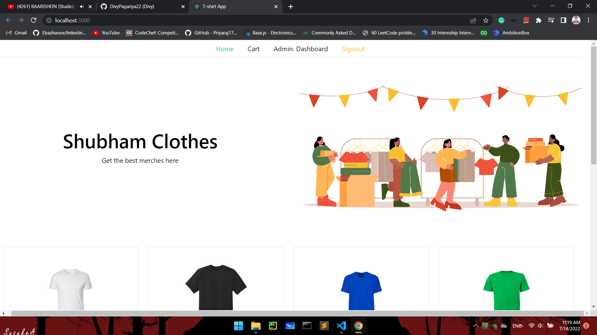

# Description

A **MERN** stack application which has CRUD functionalities. A user can buy products through stripe payment.
Admin has dashboard where products, category, and order are managed.
1. Features
   - Signin, Signout, Signup option available
   - Add or Remove product from cart
   - Update or delete products from database
   - Private and Admin Routes are available
   - Mongoose is used for managing database
   - React and  Bootstrap is used for front-end
   - NodeJs is used for backend implimantation

    

# Home Page

